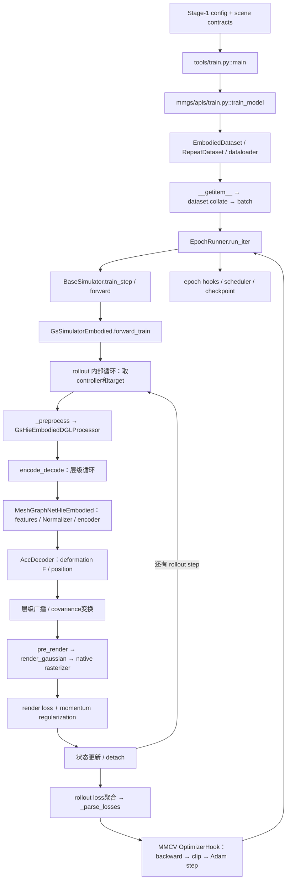

# SoMA-D360-v0 螺旋式源码学习 roadmap

创建：2026-09-29。源码核对基线：`aeeac82da31c9d44f648319d508369ba0cddd853`。

这是个人学习 TODO，不是 implementation roadmap，不改变任何实验结论或训练协议。该文件原为 `.gitignore` 排除的本地记录；2026-10-04 按用户迁移授权显式纳入 Git，以保留跨电脑学习进度。代码位置以本次基线为准；以后每次带读前重新核对函数和行范围，不按过期行号猜路径。

## 当前学习状态

- 当前任务：R02 — 从return dict认识sample。
- 下一步：R01按用户明确要求结束；当前只推进R02 sample结构。
- 全部：25项；TODO 23 / IN_PROGRESS 1 / PASS 1 / REVISIT 0。
- 2026-09-30：用户明确“R01可以结束了”，按该指令标PASS；答案由助手提供，不记录为学习者独立答题通过。
- 每次最多推进一项；30–60分钟含复述和小测，超时则拆分或记 REVISIT，不靠延长讲解硬塞。

## 学习终点与边界

能够脱离源码讲清 sample → 多步 rollout → graph/physical feature → network → deformation/Gaussian → render/loss → backward/optimizer → checkpoint，并能回到主要调用点。能够审查未来 tactile 改动的数据可用时间、identity、shape、state、gradient与训练集成。

不追求读完整个仓库；不成为 MMCV/DGL/rasterizer 维护者；不在阅读中顺手修 bug、运行 CUDA、改模型或提出最终 tactile architecture。历史审计只是旁证，不能替代当前执行路径；论文与代码不一致时明确标注，不把论文文字当作已执行分支。

固定参照：Config A、source113/local0、12861个Gaussian、30个controller points、Stage-1 gap10、Stage-2 dense gap1。tensor节点数用 N_l 表示各层数量，不把每层误写为12861；batch/camera/time维度逐项确认，不能只抄注释。

## 三档等级：标记的是本次进入的区块，不是整个文件

| 等级 | 要掌握的内容 | 停止条件 |
|---|---|---|
| L1 — Algorithm Deep Read | 输入输出、shape、公式、mutable state、gradient、上下游；必要时源码↔公式↔tensor | 能解释该设计并推演一个小变化的影响 |
| L2 — Pipeline Read | 谁调用→做什么→调谁→state怎么变化，按选定分支走 | 能画控制流与状态来源，不深入通用实现 |
| L3 — Interface Only | 输入→功能→输出→副作用→主链为什么需要它 | 写完接口卡立刻返回；单个helper通常只停留3–5分钟 |

同一函数会被多次访问：R06只看 encode_decode 的接口，R12再看层级传播，R14再看covariance。这是有意的螺旋，不要求第一次记住全部细节。

## 已核对的执行地图（规划用，不在本轮展开教学）

重要阅读边界：一次 training iteration 可以包含多步 rollout；当前路径先聚合这些步的loss，再由OptimizerHook执行一次更新。不要将“下一rollout步”与“下一optimizer step”画成同一个循环。真正入口函数名是 `train_model`。

## Pass 与导航

| Pass | 目标 | 任务 | 预计总时长 |
|---|---|---|---|
| 0 | 全局地图，只认调用箭头 | R01 | 30分钟 |
| 1 | 跟一份sample到一次iteration，不推数学 | R02–R06 | 180分钟 |
| 2 | 回来精读算法：graph/features/network/deformation/loss | R07–R15 | 465分钟 |
| 3 | 建立时间轴与gradient边界 | R16–R18 | 135分钟 |
| 4 | Training Shell；只看真实hook接口与状态恢复 | R19–R20 | **90分钟上限** |
| 5 | Stage-2按相对Stage-1的delta阅读 | R21–R23 | 145分钟 |
| 6 | Tactile候选接口审查，不定architecture | R24–R25 | 100分钟 |

这是可回访的依赖图，不是固定天数或一口气完成清单。推荐首次顺序为 R01 → R02…R06 → R07…R15 → R16…R18 → R19…R20 → R21…R23 → R24…R25。

允许的非线性路线：

- R01–R06是公共地基。之后若更关心时间，可先R16，再回Pass2；R17的梯度解释需要R15。
- Pass2内部：R07 → R08/R09 → R10/R11；R12需要R07/R11；R13与R14依次解释形变与状态；R15在预测输出已看清后进入。
- R18初次只画cache接口；R21–R23回来读Stage-2差异，不重复Stage-1算法主体。
- R19–R20可以在一次端到端粗读完成后插入；严格控制总时长。
- 遇到shape/identity疑问回R02/R07；时间错位回R03/R16；gradient疑问回R17/R19；cache来源回R18/R21。只标相关项REVISIT，不重置全部进度。
- 新发现的大块内容可拆成Rxx.a/Rxx.b；先说明原任务为什么超过60分钟，不预建80项。

## TODO总表

| ID | Pass | 主题 | Level | 分钟 | 状态 |
|---|---:|---|---|---:|---|
| R01 | 0 | 认出一次训练的入口与两层循环 | L3 | 30 | PASS |
| R02 | 1 | 从return dict认识sample | L2 | 30 | IN_PROGRESS |
| R03 | 1 | frame/window如何选出GT与controller | L2 | 40 | TODO |
| R04 | 1 | controller从PKL到sample的来源 | L2 | 35 | TODO |
| R05 | 1 | collate到train_step的接口 | L3 | 30 | TODO |
| R06 | 1 | 用调用箭头走完一个training iteration | L2 | 45 | TODO |
| R07 | 2 | graph identity、hierarchy与pin语义 | L1 | 60 | TODO |
| R08 | 2 | physical node features | L1 | 45 | TODO |
| R09 | 2 | physical edge features | L1 | 45 | TODO |
| R10 | 2 | Normalizer的统计与梯度边界 | L1 | 45 | TODO |
| R11 | 2 | 一层message passing | L1 | 45 | TODO |
| R12 | 2 | 从粗到细传播anchor与deformation | L1 | 60 | TODO |
| R13 | 2 | latent→11参数→F→position | L1 | 60 | TODO |
| R14 | 2 | covariance与renderer输入 | L1 | 45 | TODO |
| R15 | 2 | momentum与image supervision | L1 | 60 | TODO |
| R16 | 3 | prev/current/template的三步时间账本 | L1 | 45 | TODO |
| R17 | 3 | detach、loss聚合与梯度跨度 | L1 | 45 | TODO |
| R18 | 3 | Stage-1 cache的时间与identity契约 | L2 | 45 | TODO |
| R19 | 4 | loss→backward→clip→Adam及LR | L2 | 45 | TODO |
| R20 | 4 | checkpoint/load/resume保存与恢复什么 | L2 | 45 | TODO |
| R21 | 5 | Stage-2 delta：窗口与cache初始化 | L2 | 45 | TODO |
| R22 | 5 | Stage-2 delta：dense training与schedule | L2 | 45 | TODO |
| R23 | 5 | Stage-2 delta：continuous与online template | L1 | 55 | TODO |
| R24 | 6 | tactile数据可用时间与identity接口 | L2 | 45 | TODO |
| R25 | 6 | tactile端到端修改审查图 | L1 | 55 | TODO |

## 每项阅读卡

代码路径均相对SoMA根目录；下方源码索引提供可点击的完整路径。行范围为本次核对的约数，只打开指定函数区块。

### Pass 0 — 先有地图

#### R01｜认出一次训练的入口与两层循环

- Level：L3；状态：PASS；时间：30分钟；前置：无。
- 本次结束依据：用户明确要求结束R01并进入R02；示范复述及小测答案由助手提供，未宣称独立测验通过。
- 代码位置：`tools/train.py::main` 67–169；`mmgs/apis/train.py::train_model` 34–153；`core/runner/epoch_runner.py::run_iter` 10–25；`models/simulators/base.py::train_step` 90–120。每处只看调用行，`forward_train`仅看循环首尾。
- 目标：建立入口、一次batch内的rollout循环、batch间optimizer更新三者的关系。
- 必须回答：谁构建dataset/model？谁调用forward_train？backward是否发生在每个rollout step后？
- 完成标准：自己画出主调用箭头和两个循环，并确认理解；不解释任何网络公式。
- 暂跳过：CLI参数细节、registry内部、MMCV内部循环、graph/renderer实现。

### Pass 1 — 先知道数据在往哪走

#### R02｜从return dict认识sample

- Level：L2；状态：IN_PROGRESS；时间：30分钟；前置：R01（按用户明确指令结束）。
- 代码位置：`datasets/embodied_dataset.py::__getitem__` 938–974，只看`ret_dict`和return，再回798–803看idx拆分；config仅看Config A名称。
- 目标：给`inputs/gt_label/meta`画字段结构，标出cam对象、tensor、list。
- 必须回答：预测输入与监督GT怎么分开？`gs_aligned_frame`是什么？`meta.seq_num`实际赋值表达式是什么，能否只凭名字当帧数？
- 完成标准：写一张字段卡；不明shape标“待沿取数路径核对”，不凭注释补答案。
- 暂跳过：camera构造、bbox算法、evaluation、可视化。

#### R03｜frame/window如何选出GT与controller

- Level：L2；状态：TODO；时间：40分钟；前置：R02。
- 代码位置：`embodied_dataset.py::__init__/_parse_dataset`只读split、idx_mapping、frame_gap赋值；`__getitem__` 798–858、915–922；`configs/SoMA/deform360_v0_stage1.py::data.train`。
- 目标：追`split_list → video_range → GT/controller共同索引`，记录local与source变换。
- 必须回答：range右端是否包含？gap10选中了哪些帧？若controller与GT错一帧会影响哪个条件/target？
- 完成标准：手工列出source113/123/133与对应local；从代码解释首target，而非背结论。
- 暂跳过：padding未启用分支、随机背景细节、视频解码器内部。

#### R04｜controller从PKL到sample的来源

- Level：L2；状态：TODO；时间：35分钟；前置：R02/R03。
- 代码位置：`embodied_dataset.py::__getitem__` 915–922；`_load_controller_cluster_mask` 611起仅看读取frame0与当前grouping分支；`_merge_cluster_mask` 454起看返回关系；T11/T12 contracts作为只读对照。
- 目标：区分完整trajectory、抽样后的trajectory、用于分组的首帧几何。
- 必须回答：PKL里的30点从哪里来？左右identity会因时间采样变化吗？grouping和controller坐标是同一种数据吗？
- 完成标准：画出`[194,30,3] → 当前sample[T,30,3]`与独立grouping支路；能说清两者用途。
- 暂跳过：URDF生成算法、tactile原始读取、未启用聚类实现。

#### R05｜collate到train_step的接口

- Level：L3；状态：TODO；时间：30分钟；前置：R02。
- 代码位置：`embodied_dataset.py::collate` 1074–1081；`datasets/builder.py::build_dataloader`只追实际collate_fn；`dataset_wrappers.py::RepeatDataset`只看代理；`BaseSimulator.train_step`90–120。
- 目标：理解batch维度和cam/scene_name的特殊处理，不学通用collate实现。
- 必须回答：哪些值新增batch维？为什么cam/scene_name被单独取出再放回？RepeatDataset是否意味着复制数据文件？
- 完成标准：给一个sample画batch前后shape对照；指出pop这一局部副作用。
- 暂跳过：名为`camera_dataset_collate_fn`的其他helper，除非证明当前loader真的调用它；generic递归collate只当L3。

#### R06｜用调用箭头走完一个training iteration

- Level：L2；状态：TODO；时间：45分钟；前置：R03–R05。
- 代码位置：`BaseSimulator.forward/train_step`76–120；`gs_simulator_embodied.py::forward_train`625–785，分成初始化、rollout body、聚合三块；`_preprocess/encode_decode/_encode_decode_train`此时只读签名与return。
- 目标：batch → 首步graph/network/render/loss → 后续rollout → 聚合loss → OptimizerHook，暂不推导数学。
- 必须回答：首object state哪里来？target为何用frame_idx+1？哪个返回值交给optimizer hook？
- 完成标准：用source113→123→133→143走一次箭头图，给数学黑盒留下接口卡。
- 暂跳过：encode_decode几百行内部、autograd实现、camera/native renderer。

### Pass 2 — 回到决定算法的边界

每个L1任务都补“输入/输出shape、公式、可变状态、gradient、上下游”卡。首次答不全不强行PASS。

#### R07｜graph identity、hierarchy与pin语义

- Level：L1；状态：TODO；时间：60分钟；前置：R04/R06。
- 代码位置：`gs_simulator_embodied.py::_preprocess`231–258；`utils/dgl_graph.py::GsHieEmbodiedDGLProcessor.batch_preprocess`603–673，按调用只下钻422–528、561–601中的当前分支；`BuildGsDGLGraph`934–993仅看字段接口。
- 目标：看懂拼接顺序、层内邻接、p2c/c2p、聚合规则及pin传播；DGL存储实现不读。
- 必须回答：第0个node一定是Gaussian吗？30→10→2→1如何保留手指身份？层内edge和层间mapping有什么不同？
- 完成标准：画一个小型示意hierarchy并标ID空间、聚合方向与pin；若超时拆成拓扑/聚合两项。
- 暂跳过：其他processor、generic ball-query/native实现、未走到的absolute hierarchy分支。
- 论文卡：§3层级表示；代码聚合权重与论文表述要逐项核对，不预设完全一致。

#### R08｜physical node features

- Level：L1；状态：TODO；时间：45分钟；前置：R07。
- 代码位置：`backbones/meshgraphnet_embodied.py::init_node_features`362–401；`__init__`只看node_encoder/attr_mode/normalizer维度；`init_features`403起只看输入字段。
- 目标：把anchor二阶差分、relative velocity、external与attribute连接到node embedding。
- 必须回答：每个差分用哪几个时刻？gravity进入哪一项？为何不能直接把新增tactile标量拼到任意shape上？
- 完成标准：写出当前分支的两条physical feature公式，标[N_l,3]到[N_l,D]；注明单位和gradient来源。
- 暂跳过：Normalizer内部留R10，MLP内部暂作接口。
- 论文卡：§4.2.2 force-driven dynamics；代码中的anchor参考系表达与论文概念分开记录。

#### R09｜physical edge features

- Level：L1；状态：TODO；时间：45分钟；前置：R07；可与R08交换。
- 代码位置：`meshgraphnet_embodied.py::init_edge_features_fixbug`314–360；`_edge_theta`255–268仅当前edge_theta调用；`__init__`核对edge_mode/维度。
- 目标：理解receiver/sender方向、当前/模板相对距离、ratio、relative velocity及角度feature。
- 必须回答：边反向时哪些量变号？距离ratio相对哪个template？为何edge feature不是直接把两个world position拼起来？
- 完成标准：画一条边，逐分量标shape、物理含义、来源时刻；核对与edge_encoder输入维度一致。
- 暂跳过：fix_bug=False旧分支，不做数值bug诊断。
- 论文卡：interaction graph；精确feature拼接次序以源码为准，不编造论文公式号。

#### R10｜Normalizer的统计与梯度边界

- Level：L1；状态：TODO；时间：45分钟；前置：R08/R09。
- 代码位置：`utils/normalization.py::__init__/_accumulate/_mean/_std_with_epsilon/forward/train`；`meshgraphnet_embodied.py`223–250及385附近核对调用。
- 目标：分清统计更新与可微归一化、FP64统计与网络输出dtype、共享normalizer与单层状态。
- 必须回答：detach发生在统计支路还是整个forward？train/eval怎么控制累计？四个无梯度Parameter为何仍需要checkpoint？
- 完成标准：画归一化的两条数据支路，解释统计状态与gradient并不矛盾。
- 暂跳过：不重做T26数值实验、不分析新bug；inverse只记接口。
- 论文卡：feature normalization属于实现支撑，FP64 patch是本项目数值工程决定，不伪称论文创新。

#### R11｜一层message passing

- Level：L1；状态：TODO；时间：45分钟；前置：R08/R09；Normalizer可暂黑盒。
- 代码位置：`MeshGraphNetEncoderLayer.interact_feature/node_feature/forward`60–121；`MeshGraphNetEncoder.forward`153起只看层间重复。
- 目标：edge update → incoming message sum → node update，理解residual与共享操作。
- 必须回答：聚合是sum还是mean？哪些node信息进入edge MLP？梯度能否从一个node loss回到邻居feature？
- 完成标准：手画两个node一条edge的消息与梯度箭头，区分一次message layer和一次时间推进。
- 暂跳过：DGL SpMM/native kernel内部；只标其输入输出边界。
- 论文卡：graph message passing；tensor为edge[E_l,D]和node[N_l,D]。

#### R12｜从粗到细传播anchor与deformation

- Level：L1；状态：TODO；时间：60分钟；前置：R07/R11。
- 代码位置：`gs_simulator_embodied.py::encode_decode`276–392，只分读层级循环入口、相邻c2p广播、祖先hie_*广播三块。
- 目标：区分anchor_next_state与hie_anchor_next_state，以及细到粗建图和粗到细预测。
- 必须回答：哪一层先预测？share_weight共享的是什么？哪几个graph字段被原地写入？
- 完成标准：画一个三层调用示意，标每层输入、输出、被覆盖字段与controller约束。
- 暂跳过：F参数化暂作接口交给R13；renderer暂作接口。
- 论文卡：§3层级传播，与当前代码的层级循环和矩阵次序对照。

#### R13｜latent→11参数→F→position

- Level：L1；状态：TODO；时间：60分钟；前置：R12。
- 代码位置：`heads/acc_decoder.py::node_pred_pos_dg/predict`290–352、`scalar_incompressible_constrain`84–92；`utils/deformation_gradient.py::get_deformation_gradient_matrix/build_rotation/build_scaling`仅直接调用。
- 目标：11维参数如何构造两旋转和三尺度，如何作用于相对anchor的模板位置。
- 必须回答：网络是否直接输出XYZ？quaternion次序是什么？det/volume约束是否等于限制所有方向拉伸？
- 完成标准：画[N_l,D]→[N_l,11]→[N_l,3,3]→[N_l,3]，写公式并指出pin发生的位置。
- 暂跳过：极分解的未调用getter、数值修法、其他decoder。
- 论文卡：局部deformation gradient；代码F=U diag(s) Vᵀ，位置来自anchor与template的组合。

#### R14｜covariance与renderer输入

- Level：L1；状态：TODO；时间：45分钟；前置：R13。
- 代码位置：`gs_simulator_embodied.py::encode_decode`381–444；`utils/transformation_utils.py::apply_cov_rotations_batched`33起；`AccDecoder.pre_render`127–157与`utils/render.py::render_gaussian`134起仅参数/返回边界。
- 目标：将层级F组合、packed covariance与渲染输入接起来；renderer内部降为L3。
- 必须回答：packed6如何对应对称3×3？初始SH/opacity与预测mean/cov在哪里合流？哪个tensor梯度会穿过renderer回来？
- 完成标准：写[N,6]↔[N,3,3]及Σ变换，标controller切片、两camera图像shape与gradient边界。
- 暂跳过：CUDA rasterization实现、visibility排序、screenspace梯度的kernel细节。
- 论文卡：§3 Gaussian covariance传播；数学公式与实际多层矩阵顺序分别核对。

#### R15｜momentum与image supervision

- Level：L1；状态：TODO；时间：60分钟；前置：R14。
- 代码位置：`AccDecoder.forward_train_regularize/forward_train`170–215；`heads/sim_head.py::loss`52起只看term_filter和分发；`losses/l2_loss.py`、`losses/ssim_loss.py`只读weight/reduction；simulator512–530与当前loss config。
- 目标：把实际优化的scalar loss对应到位置、mass、masked RGB、camera聚合；非激活loss不读。
- 必须回答：momentum项代码究竟对什么求和？背景置零与weight有什么区别？SSIM是否真的消费传来的mask_weights？
- 完成标准：一张“loss→输入→weight/reduction→梯度去向”表；复杂时拆成momentum/image两次任务，不超过60分钟。
- 暂跳过：selfsup/static等未启用分支、accuracy聚合内部。
- 论文卡：§4.2.4监督概念；D360缺独立robot mask的语义以T16/代码为准，不能照搬论文叙述。

### Pass 3 — 建立时间轴

#### R16｜prev/current/template的三步时间账本

- Level：L1；状态：TODO；时间：45分钟；前置：R06；不要求先学完全部数学。
- 代码位置：Stage-1 `forward_train`660–735；`_preprocess`231–258；`_rollout_steps`584–612仅requested/effective关系。
- 目标：分别记录frame_idx、source target、controller previous/next、prev/cur/template/cov的来源。
- 必须回答：source123由哪个state产生？第二步template是否等于第一步prediction？pred_cov是否直接赋回cur_cov？
- 完成标准：填写113→123→133→143三行状态账本，区分“变量名像更新”与真实赋值。
- 暂跳过：LR/runner实现，网络内部暂用已读接口。
- 论文卡：时序conditioned state transition；不把论文简写G_t当成所有Python字段同步更新。

#### R17｜detach、loss聚合与梯度跨度

- Level：L1；状态：TODO；时间：45分钟；前置：R15/R16。
- 代码位置：Stage-1 `forward_train`711–768；`BaseSimulator._parse_losses`147–189；`accumulate_gradient/avg_loss`当前config。
- 目标：区分state跨步梯度、每步loss计算图、跨batch梯度累计，避免按flag名字猜。
- 必须回答：为何detach下一步state不阻止当前loss反传？多个loss何时聚合？log_vars.item与用于backward的loss有什么区别？
- 完成标准：三步计算图用实线/截断线标注，指出一次optimizer更新的边界。
- 暂跳过：PyTorch autograd engine实现、activation checkpointing其他分支。

#### R18｜Stage-1 cache的时间与identity契约

- Level：L2；状态：TODO；时间：45分钟；前置：R16。
- 代码位置：`tools/deform360_adapter/generate_stage1_cache.py`仅config/checkpoint选择、frame_gap设置、实际推理调用与验证；Stage-1 `save_gaussian`446–455；T27 contract只看keys/provenance。
- 目标：initial/cached prediction/future reconstruction三者区分，建立Stage-2入口草图。
- 必须回答：frame_10是第10帧还是第10个coarse step？frame0来源是什么？cache identity如何保证不是逐帧新PLY？
- 完成标准：画0,10,…,150键到source113,123,…的映射与来源箭头。
- 暂跳过：文件hash实现、PKL/torch.save内部、Stage-2 simulator主体。

### Pass 4 — Training Shell，总计75–90分钟

#### R19｜loss→backward→clip→Adam及LR

- Level：L2；状态：TODO；时间：45分钟；前置：R06/R17。
- 代码位置：`apis/train.py`构造optimizer及110–113 hook注册；`core/runner/epoch_runner.py::run_iter`；当前安装版MMCV `OptimizerHook.after_train_iter/clip_grads`只看调用顺序；`core/lr_updater/hooks.py::HoodLrUpdaterHook`123–169及当前config。
- 目标：掌握数值更新的责任分界，MMCV内部实现保持L3。
- 必须回答：zero_grad/backward/clip/step顺序？grad_norm是在clip前还是后？epoch0的LR为何不一定等于base LR？
- 完成标准：一张单batch时序图，能按当前schedule算首LR；不研究Adam实现细节。
- 暂跳过：分布式通信、fp16训练、其他scheduler、runner所有生命周期细节。

#### R20｜checkpoint/load/resume保存与恢复什么

- Level：L2；状态：TODO；时间：45分钟；前置：R10/R19。
- 代码位置：`apis/train.py`141–153；当前安装版MMCV `CheckpointHook`、`EpochBasedRunner.save_checkpoint`、`BaseRunner.resume/load_checkpoint`仅字段与调用；T24 recovery contract只对照保存状态清单。
- 目标：区别learned state、optimizer state、counter与非state_dict运行时缓存；恢复语义比序列化实现重要。
- 必须回答：只load model与resume有什么不同？Normalizer是否保存？未来tactile temporal cache若是普通dict会自动保存吗？
- 完成标准：状态表逐项写owner、保存/重建方式；解释Stage-1→Stage-2为何不能混同resume。
- 暂跳过：pickle、storage I/O、checkpoint网络下载、numerical reproducibility追查。
- 备注：MMCV路径以服务器已安装版本为准，仅只读查看源码；不为了阅读运行训练入口/import CUDA模型。

### Pass 5 — Stage-2只读delta

#### R21｜窗口与cache初始化delta

- Level：L2；状态：TODO；时间：45分钟；前置：R18/R20。
- 代码位置：`configs/SoMA/deform360_v0_stage2.py::data/model/load_from/resume_from`；`gs_simulator_embodied_stage2.py::_init_scene_init_pos_cov`218–241与`_init_scene_init_pos_cov_from_raw_gaussian`243–256；dataset只回访R03。
- 目标：把Stage-1 initial PLY入口替换成Stage-2各window起点，分清segmented和continuous初始化分支。
- 必须回答：model gap10与dataset gap1分别控制什么？window起点如何拼cache key？scene_init字典与model parameters是否同一种状态？
- 完成标准：写Stage-1/Stage-2初始化差异表，保留共同算法为一行“复用R07–R15”。
- 暂跳过：重复的backbone/renderer实现、cache序列化。
- 论文卡：§4.2.3多时间分辨率；具体D360 cache命名与初始化策略属于工程协议。

#### R22｜dense training与schedule delta

- Level：L2；状态：TODO；时间：45分钟；前置：R21/R19。
- 代码位置：Stage-2 `forward_train`683–865，仅对比state/cache选择、num_frame、update flags、state assignment；`_rollout_steps`642起；D360 Stage-2 config与official `cloth_lift_stage2.py`只对照schedule和初始化字段。
- 目标：理解15个window、dense targets、relative curriculum、fresh optimizer与learned Normalizer的关系。
- 必须回答：requested和effective rollout为何不同？evaluation会否改变之后training起点？weights-only初始化后counter和LR怎样对应官方相对语义？
- 完成标准：手走一个window（如local70起），写出cache key、首target、有效步数、末target与禁止越界条件。
- 暂跳过：重新精读Stage-1已有算法、完整训练日志、smoke临时override实现。

#### R23｜continuous与online template delta

- Level：L1；状态：TODO；时间：55分钟；前置：R16/R21/R22。
- 代码位置：`apis/test.py::single_gpu_rollout`163–240；Stage-2 `simple_test`898–1055，只读pred_frame_idx、template_key、reset_from_template与状态返回；`update_gaussian`502–513；T31 provenance仅作对照。
- 目标：区分当前prediction传递与在线template变更；不把“无GT reset”误读为所有历史state都无重置。
- 必须回答：local9/10/11边界prev/current/template各来源是什么？缺future template时为何不能读future cache补上？跨train/test边界是否更换initial state？
- 完成标准：一张boundary状态账本，明确current/prev/cov的真实赋值、online字典副作用与no_grad范围；不修改现有行为。
- 暂跳过：save_image、metrics aggregation、可视化、rasterizer重读。
- 论文卡：long-horizon temporal rollout；D360 online template具体实现须标为源码/项目约定，不套论文未给出的公式。

### Pass 6 — 只画tactile候选修改接口

#### R24｜tactile可用时间与identity接口

- Level：L2；状态：TODO；时间：45分钟；前置：R03/R04/R21/R23。
- 代码位置：相邻Deform360仓库`deform360/tactile.py`、`examples/load_tactile.py`仅接口；SoMA dataset的R02/R03区块；已有frame mapping与aligned timestamp provenance，不读取/下载整套数据。
- 目标：从原sensor数据到history window画候选入口，所有未定tensor维度用符号表示。
- 必须回答：预测t+1时哪些tactile时刻合法可见？taxel identity能否直接当Gaussian identity？gap10和gap1如何采样同一历史？
- 完成标准：画时间对齐与shape草图，标出sensor/gripper/node三个identity空间和防未来信息泄漏检查；不选encoder架构。
- 暂跳过：raw传感器处理内部、触觉重建、增加graph节点的具体方案。

#### R25｜tactile端到端修改审查图

- Level：L1；状态：TODO；时间：55分钟；前置：R08–R17/R20/R22–R24。
- 代码位置：回访sample入口、simulator参数传递、backbone feature/latent入口、model builder、optimizer构造、state_dict/checkpoint接口；不新增代码。
- 目标：能审查候选改动放在哪层、是否接通训练与连续推理，而非设计最终architecture。
- 必须回答：新feature在哪一步会被丢掉？新模块如何进入optimizer和checkpoint？history mutable state在segmented/continuous/resume时如何维护且不泄漏future？
- 完成标准：至少选择两个候选接入边界做七项审查，注明仍需实验的假设；脱稿讲完整训练链后由用户确认，不自动宣布可以实施。
- 暂跳过：最终融合结构、超参、实现patch、性能比较。

## 论文↔源码↔shape卡（只作为导航）

论文来源：[SoMA, arXiv:2602.02402v1](https://arxiv.org/html/2602.02402v1)。此次核对了章节与层级位置/covariance的公式入口，后续学习时才展开推导。下列shape来自当前源码；论文概念不等于所有实现分支均启用。

| 概念/阅读入口 | 源码区块 | shape检查 | 一句话意义 |
|---|---|---|---|
| §3层级图、式(1) | R07聚合 | node[N_l,*]、p2c关系 | 子节点形成粗层表示 |
| §4.2.2力驱动条件 | R08/R09/R11 | node/edge→D=128 | 把参考系运动与交互关系编码成latent |
| §3式(2)层级位置 | R12/R13 | F[N_l,3,3]、x[N_l,3] | 模板相对anchor经过形变传播 |
| §3式(3)covariance | R14 | packed[N,6]↔[N,3,3] | 形变同时作用于Gaussian形状 |
| §4.2.4监督 | R15 | 多camera图像→scalar | 图像与运动一致性提供训练信号 |
| §4.2.3多时间分辨率 | R18/R21/R22 | coarse keys与dense窗口 | 粗阶段预测提供细阶段起点 |

每张L1笔记还必须补：公式中的每个符号实际来自哪个tensor、单位是什么、是否detach、哪个对象会被修改。若论文与代码不一致，写“论文概念 / 当前实现 / D360决定”三栏，不消除差异。

## 大文件的局部阅读边界

| 文件 | 本轮学习真正进入的路径 | 默认黑盒/跳过 |
|---|---|---|
| embodied_dataset.py | 当前scene/split初始化→getitem→controller/GT/meta→实际collate；mapping只按当前配置 | camera interpolation、evaluate、visualize、debug/test、unused augment |
| gs_simulator_embodied.py | forward_train→preprocess→encode_decode当前层级→loss/state赋值 | selfsup/EM/legacy和未启用分支 |
| gs_simulator_embodied_stage2.py | 只读cache init、dense window、state/update flags、continuous template delta | 与Stage-1相同的主体不重读 |
| dgl_graph.py | GsHieEmbodiedDGLProcessor当前分支；选边/聚合属于L1 | 其他processor与DGL底层存储/kernel |
| meshgraphnet_embodied.py | 当前feature分支、normalizer调用、一个encoder layer | 未启用edge/attribute分支 |
| acc_decoder.py | 当前deformation输出、position/pin、regularization/render loss | 不启用的selfsup/static/其他head |
| render.py | render_gaussian输入、输出与autograd边界 | native kernel、tile/sort/atomic内部 |
| train/runner/hooks | 构建与实际调用顺序、可恢复状态 | 框架泛化能力、distributed、serialization内部 |

遇到camera helper、image IO、registry、generic DGL构造、logger、JSON、visualization或evaluation aggregation时，带读者必须提醒：**“这属于L3，目前知道接口就够了。”** 只有当前问题确实需要进一步下钻，才解释升级原因并缩小区块。

## 每次带读的固定流程与状态门槛

1. **定位价值**：几句话指出本任务位于哪条箭头，不开始长讲解。
2. **限定打开范围**：给文件、函数、当前行范围和区块；明确现在跳过什么。
3. **先问后讲**：从任务卡给3–5个阅读问题，让学习者带问题看；不立即公布所有答案。
4. **解释关键路径**：先control flow/tensor/state，再必要数学；禁止把几百行逐行翻译。
5. **停下来复述**：请学习者用自己的话说明该段；等待实际回答，不把沉默当理解。
6. **2–4道小测**：测试错一帧、detach边界、identity/shape改变的影响，不考背函数名；按回答纠正，必要时回访。
7. **用户确认后更新**：只在学习者明确确认理解后标PASS，并记录复述/小测摘要；本次停在当前项，下一项另行开始，不自动连讲。

状态：TODO=尚未开始；IN_PROGRESS=正在带读/等待复述；PASS=复述与小测完成且用户确认；REVISIT=发现理解缺口/源码变化需要回看。每次最多一项IN_PROGRESS。已有实验PASS不等于学习PASS。

更新时同步总表、对应阅读卡、顶部计数和以下记录。不得将学习进度写入implementation roadmap。

| 日期 | ID | 原状态→新状态 | 学习者复述摘要 | 小测与纠正 | 用户确认/待回访 |
|---|---|---|---|---|---|
| 2026-09-29 | 全部 | 新建TODO | 未开始 | 未开始 | 无PASS |
| 2026-09-30 | R01 | TODO→IN_PROGRESS | 待学习者复述 | 先给阅读范围和问题，小测待复述后 | 用户授权开始，未确认完成 |

## Tactile修改的七项检查模板

1. 改动入口：dataset字段/参数传递/graph feature/latent/module中的哪一层，为什么。
2. 上游来源与可用时间：sensor、timestamp、history cutoff，是否在预测时已可获得。
3. Tensor shape / identity：batch/time/sensor/taxel/gripper/node/Gaussian分别是谁；如何映射。
4. Mutable state：谁拥有history缓存，何时更新、detach、reset，是否影响下一batch。
5. Gradient path：新增encoder/fusion是否连到真实loss，哪里可能断梯度。
6. Stage-1 / Stage-2 / continuous一致性：gap、cache起点、history边界、在线状态如何保持同义。
7. Training integration：module注册、optimizer参数集、loss、scheduler/resume、checkpoint完整性。

R25只填候选接口和待验证项，不做最终选型。不把未来真实tactile观测与已知robot action一概视为同样的“未来可用条件”。

## 完成整条路线的验收

- 能不看源码讲一次多步训练iteration，并指出核心源码入口。
- 能写sample/graph/feature/F/Gaussian/render的shape链。
- 能解释state传播与gradient传播不是同一件事。
- 能区分Stage-1 cache、Stage-2 segmented起点、continuous在线template。
- 能区分weights-only load、resume和未序列化runtime state。
- 能用七项模板审查tactile接入提案，指出放错层/时间泄漏/identity错配，而非只看程序能否跑。

## 源码索引

- [train入口](/Users/qdtrr/Projects/tcgs/SoMA/tools/train.py:67)
- [train_model](/Users/qdtrr/Projects/tcgs/SoMA/mmgs/apis/train.py:34)
- [dataset](/Users/qdtrr/Projects/tcgs/SoMA/mmgs/datasets/embodied_dataset.py:798)
- [Stage-1 simulator](/Users/qdtrr/Projects/tcgs/SoMA/mmgs/models/simulators/gs_simulator_embodied.py:625)
- [graph processor](/Users/qdtrr/Projects/tcgs/SoMA/mmgs/models/utils/dgl_graph.py:406)
- [backbone](/Users/qdtrr/Projects/tcgs/SoMA/mmgs/models/backbones/meshgraphnet_embodied.py:173)
- [Normalizer](/Users/qdtrr/Projects/tcgs/SoMA/mmgs/models/utils/normalization.py)
- [decoder](/Users/qdtrr/Projects/tcgs/SoMA/mmgs/models/heads/acc_decoder.py:290)
- [deformation](/Users/qdtrr/Projects/tcgs/SoMA/mmgs/models/utils/deformation_gradient.py)
- [covariance helper](/Users/qdtrr/Projects/tcgs/SoMA/mmgs/utils/transformation_utils.py:33)
- [renderer边界](/Users/qdtrr/Projects/tcgs/SoMA/mmgs/models/utils/render.py:134)
- [Stage-2 simulator](/Users/qdtrr/Projects/tcgs/SoMA/mmgs/models/simulators/gs_simulator_embodied_stage2.py:218)
- [continuous调用者](/Users/qdtrr/Projects/tcgs/SoMA/mmgs/apis/test.py:163)
- [Deform360 tactile接口](/Users/qdtrr/Projects/tcgs/deform360/deform360/tactile.py)

当前只推进R02；R01按用户明确结束指令标PASS，既有REVISIT补记作为历史保留。

### 2026-09-30 学习进度补记

- R01：IN_PROGRESS→REVISIT；用户要求助手补全四句并提供小测答案，未收到学习者理解确认，不标PASS。
- R02：TODO→IN_PROGRESS；用户明确要求进入下一项，作为本次推进顺序例外。
- 本次只讲sample返回结构；不推进R03，不修改实现代码。

### 2026-09-30 状态校正

- 用户原话“R01可以结束了，接下来进入R02”作为明确结束授权：R01 REVISIT→PASS。
- 本次提供四句示范复述及小测答案，不记为学习者独立作答。R02保持IN_PROGRESS，未进入R03。
