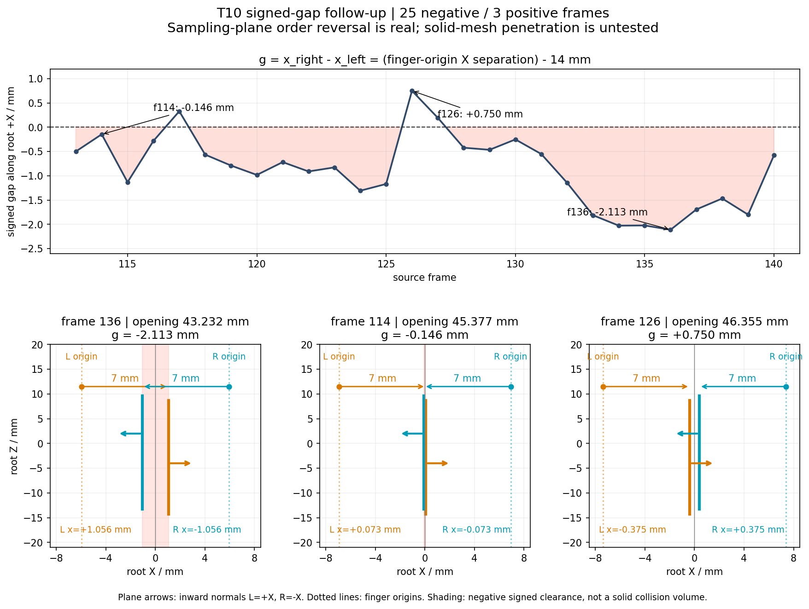

# T10 signed gap follow-up

2026-09-25。只解释现有 T10/review 几何；不修改源码、T10 contract 或其 PASS 结论，不执行 T11/T12，不 commit/push。

**结论：负 gap 不只是符号约定，也不是左右标签误换；它记录了两侧采样面沿闭合轴的真实位置顺序反转。** 在“相向接触面”的解释下，这是毫米级负间隙；但采样面是零厚度几何点集，不能由此直接认定实体夹爪网格发生相同深度的穿透，更不能仅凭量级小认定可接受。



## 1. 精确定义：沿 root +X 的有符号间隙

review 使用 `g = P_root[15,0] - P_root[0,0]`：同一 row/column 的 right/left anchor 的 **root X 坐标差**。因为各手指的 15 点都在同一恒定 X 平面上，这也等于两侧采样面中心的 X 坐标差，不依赖选哪个匹配 row/column。

设官方函数给出的左关节位移为 `j`，单位米：

```text
left finger origin X  = -0.04246242 + j
right finger origin X = +0.04246242 - j

left sampling plane X  = left origin X  + 0.007
right sampling plane X = right origin X - 0.007

g = x_right - x_left
  = 0.07092484 - 2*j
  = finger-origin X separation - 0.014
```

- `g > 0`：左采样面在较小 X，右采样面在较大 X，符合张开状态的相对顺序。
- `g = 0`：两个无限平面共面；有限采样面的 Y/Z footprint 也有重叠。
- `g < 0`：右采样面已经位于左采样面的较小 X 一侧，越过预期闭合位置。
- 测量轴不是世界固定 X、camera X 或估计出的三角形法向。转到世界坐标后，同一量为 `dot(R_world_from_root @ [1,0,0], center_right_world-center_left_world)`，root 的旋转和平移不会制造或消除负号。
- 它不是 finger 原点距离，不是两点欧氏距离，也不是实体 mesh 的最小距离。匹配点还有 `+1 mm` 的 right-minus-left root-Z 偏移，因此匹配点距离为 `sqrt(g² + (1 mm)²)`，不会因 g 接近 0 就变成重合点。

## 2. 局部坐标、法向与开合方向

两侧 finger link 相对 root 的旋转都为 `Rx(pi)=diag(1,-1,-1)`，来自两个 `Rx(pi/2)` joint origin 的组合；finger revolute joint 在当前官方几何中为 0。

| 项目 | left | right |
|---|---|---|
| finger origin（root，m） | `[-0.04246242+j, 0.0835, 0.0097]` | `[0.04246242-j, 0.0835, 0.0107]` |
| anchor 的 finger-local X | `+0.007 m` | `−0.007 m` |
| 本说明按张开状态定义的向内法向 | `+root X` | `−root X` |
| opening 增大时 | 向较小 root X 移动 | 向较大 root X 移动 |

两个局部 surface 都由 Y/Z 方向的固定网格展开；在 root 下共同 Y 范围为 `[139.5,201.5] mm`。left Z 为 `[-14.2583,8.6583] mm`，right Z 为 `[-13.2583,9.6583] mm`；Y/Z footprint 存在重叠。

**法向的符号需区分几何与表示。** T10 contract 没有 normal 字段，gap 计算也没有使用 normal。上述相向法向是本次解释用的定向约定，没有添加到 T10。两面采用相同 row/column 遍历方式，若机械地计算 `column tangent × row tangent`，两面都会得到 `+root X`；这不意味着右面真实向内法向也是 +X，也不是本次负 gap 的成因。点身份仍由 `finger_left/right` 和固定 row/column 决定，未交换或按坐标重排。

官方 opening 关系为：

```text
o = clip(opening, 0.04, 0.112)
j = 0.038 - (o-0.04)/0.072 * 0.033
g = -0.00507516 + (11/12)*(o-0.04)    # 单位 m
```

未 clipping 区间内，`dx_left/do=-11/24`，`dx_right/do=+11/24`，`dg/do=11/12 > 0`，开合方向正确。`g=0` 对应的 opening 是 **45.536538 mm**；opening 为正不等于采样面间隙为正，因为 opening 经官方映射转换后还包含固定指面 offset。113–140 全部没有触发 clipping。

## 3. 实际窗口统计

共 28 帧：**25 帧负、3 帧正、0 帧恰好为零**。正 gap 出现在 source **117、126、127**。逐帧 scalar 数据和输入 hash 见 [signed_gap_followup.json](signed_gap_followup.json)；未输出任何 controller trajectory。

| 代表情形 | Source frame | Opening / mm | finger 原点 X 间距 / mm | left 面 X / mm | right 面 X / mm | gap / mm |
|---|---:|---:|---:|---:|---:|---:|
| T10 initial | 113 | 44.991521 | 13.500401 | +0.249800 | −0.249800 | **−0.499599** |
| 最负 | 136 | 43.231713 | 11.887244 | +1.056378 | −1.056378 | **−2.112756** |
| 最接近零 | 114 | 45.377092 | 13.853841 | +0.073080 | −0.073080 | **−0.146159** |
| 最大正 gap | 126 | 46.355146 | 14.750391 | −0.375195 | +0.375195 | **+0.750391** |

以 frame 136 为例，两指 origin 仍按预期分居两侧，但 X 间距只有 **11.887244 mm**；两侧各向内偏移 7 mm，总计 14 mm，于是得到 **−2.112756 mm**。这是现有 opening mapping 与 surface offset 联合产生的几何结果，不是 float32 舍入、投影方向或左右点序造成的负号。

## 4. “交叉”“穿透”“可接受”分别意味着什么

1. **并非纯符号问题。** 将 g 改成 −g 只会交换正负标签，不能同时使张开与近闭合状态都具有预期的 left-before-right 顺序。本说明没有更改定义。
2. **确实存在采样面位置顺序反转。** 以相向面的 half-space 解释，属于负 clearance／采样面越过闭合位置，幅度从亚毫米到约 2.11 mm。
3. **不等于每个负 gap 帧的两个零厚度平面互相相交。** 固定帧只要 `g≠0`，它们仍是两张分离的平行平面，其无符号距离为 `|g|`。连续开合跨过 g=0 时，才会经过共面的状态；有限 Y/Z footprint 有重叠，但离散配对 anchor 因 1 mm Z offset 并不因此逐点重合。
4. **未证明实体 mesh 穿透深度。** T10 sampling surface 不包含 finger mesh 的厚度、软材料形变或 collision query；本轮不做实体网格碰撞检测，也不将负 gap 的绝对值直接叫作实体 penetration depth。
5. **尚不能认定为“可接受的小量穿插”。** 本项目尚未对 calibration 误差、接触几何和 controller 邻接关系建立允许毫米数；仅凭数值较小不足以通过物理验收。

## 5. 对后续使用及 commit 的建议

固定身份的坐标生成仍是 pose/opening 的有限、连续函数；负 gap 不造成点 ID 翻转或格式失败，因此本次不推翻 T10 的数值 PASS。不过，两指采样位置接近或越过预期闭合位置，可能影响后续按距离建立的 controller 邻接或接触解释；尚未运行 graph 或训练，不能声称对模型无影响。

**当前不建议将 T10 当作已完成人工几何验收的 checkpoint 直接提交。** 先由用户决定是否接受并明确记录该近闭合几何偏差，或单独授权进一步定位；无需在本次解释检查中改代码。若以后仅作审计快照提交，也应完整保留这一限制，不能将其表述为无穿透验证已通过。

## 证据来源和本轮变更

- T10 contract 的固定 offsets、点序和 frame 113 root 坐标。
- 原 review 的 113–140 opening/joint/gap 数值，重新按上述公式计算，误差小于 `1e-14 m`。
- `deform360/processing/control_points_stage.py:60–114` 的两指 root 几何及固定 anchor offsets。
- `deform360/processing/urdf_render.py:31–46` 的 opening-to-joint 定义；`assets/umi/umi_tactile.urdf:101–140` 附近的 joint origin 与 fixed anchor。
- 本轮新增本说明、PNG 和 JSON；roadmap T10 Evidence 只增加 follow-up 链接。原 T10 contract、已有 review 媒体与 metadata 均保持原字节，T10 PASS 和 T11/T12 状态未改变。全部改动属于 SoMA / `deform360-adaptation`，未暂存、commit、push 或同步服务器 checkout。
